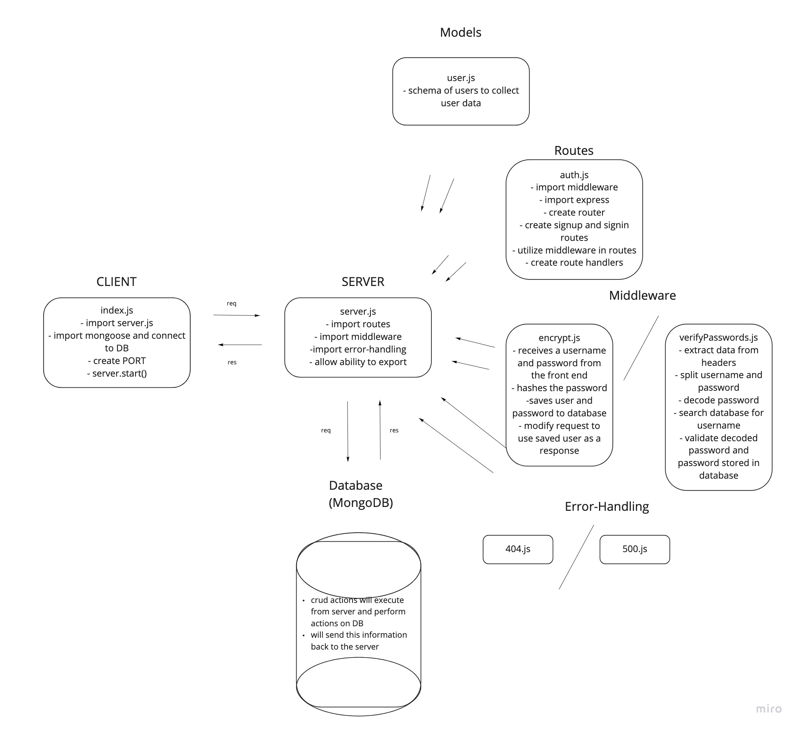

# LAB - Class 06

## Project: Authentication

### Author: Jenner Dulce

### Links and Resources

- [ci/cd](https://github.com/jennerdulce/api-server/actions) (GitHub Actions)
- [Pull Request](https://github.com/jennerdulce/api-server/pull/1)
- [HEROKU App](https://jennerdulce-basic-auth.herokuapp.com/)

### Setup

#### `.env` requirements (where applicable)

- `PORT` - 3000

#### How to initialize/run your application (where applicable)

- `nodemon`
- `node index.js`
- `npm start`

#### How to use your library (where applicable)

#### Tests

##### Assert the following

- POST to /signup to create a new user
- POST to /signin to login as a user (use basic auth)
- Need tests for auth middleware and the routes
  - Does the middleware function (send it a basic header)
  - Do the routes assert the requirements (signup/signin)

#### UML

;
